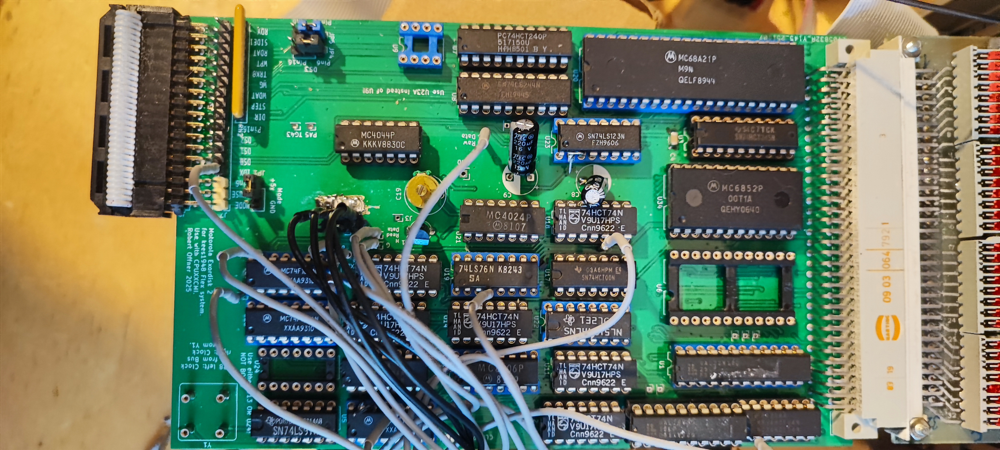

# Motorola Exordisk Remake
for kees 1948 Board

This is a Remake of the Motorola Exordisk Board for kees1948 FLEX and UniFLEX Project.
Use it with a CPUXXCMI Board with a 6802 CPU @ 1MHz and the modifications on the Exorciser page.

Exordisk_v1 is the second revision of the Exordisk Board. Use this to build.

Exorset Floppy is the first version of the Exordisk board. It has a lot of problems!

In the GAL subdir. are the equations and .jed files for the exordisk remake board.

This is the Board:
