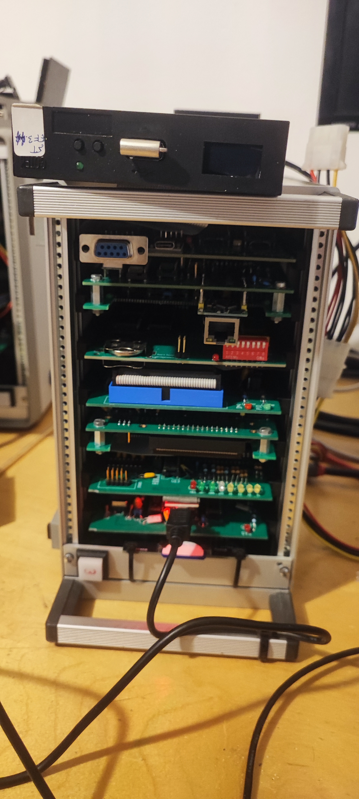

# kees1948_Boards
kees 1948 Uniflex Remake

This Repository is for my Remake of the PCBs from kees1948 FLEX and UniFLEX Project.
I like SMD Components and started with a new Version of the CPU09RAM Board with Battery Backup. 

I also started some modifications to the CPUXXCMI Board to run the Exorciser Firmware (Exbug) and in the near future i will make a Exordisk Hardware to read real floppies. See the Exorciser Subdirectory.

This is my Uniflex System:
